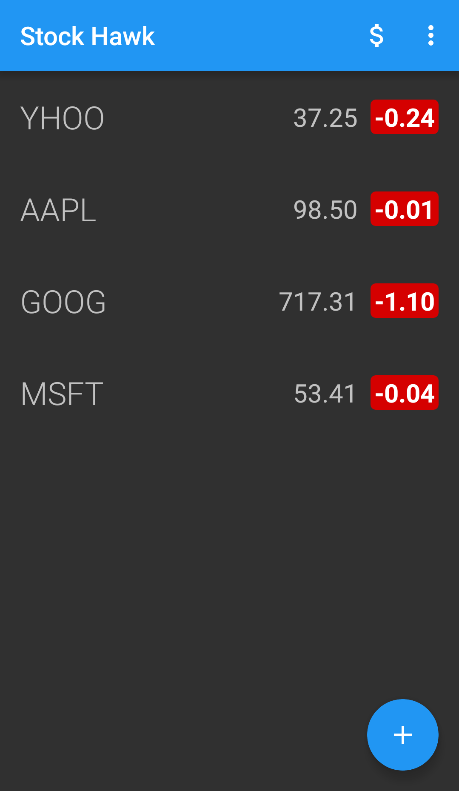
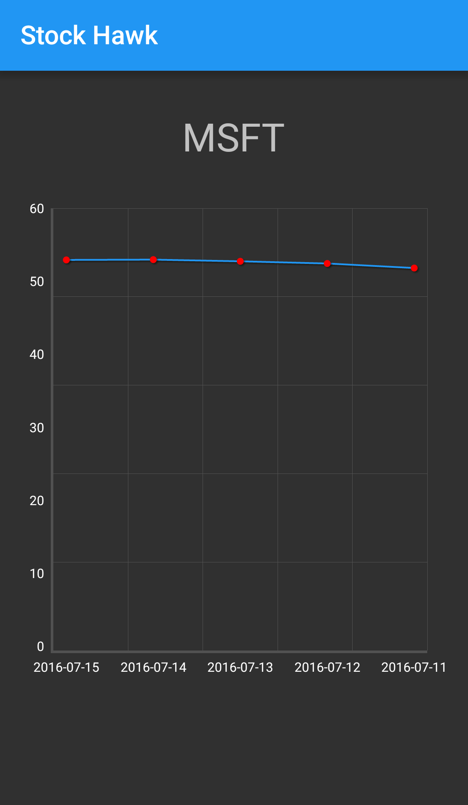
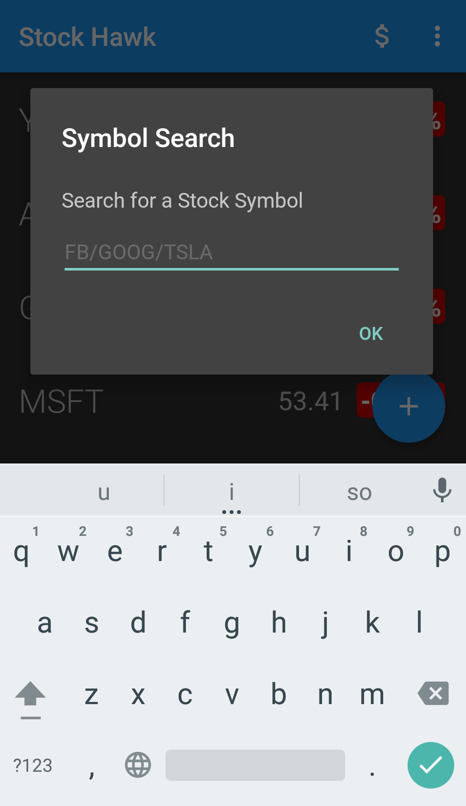
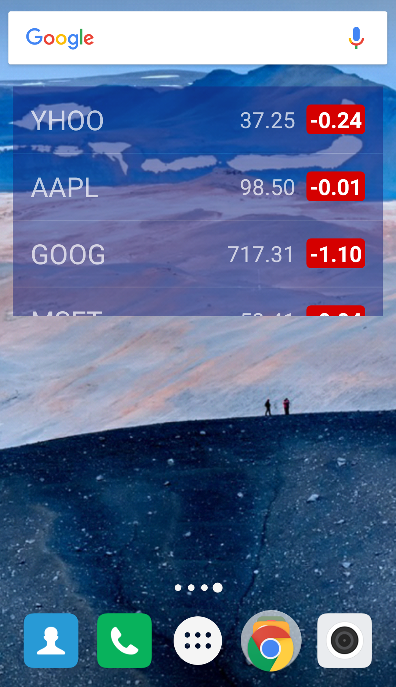

# StockHawk

Stock Hawk is an Android App for Curating Stock Quotes and Details. The App includes handling error cases, building a widget for the home screen, adding support for screen readers, optimizations for localization, and data visualization via a library.

## Screenshots

#### Main Screen

#### Stock Graph

#### Stock Search

#### Widget

## Built With
* [Retrofit](https://github.com/square/retrofit) - Type-safe HTTP client for Android and Java by Square, Inc.
* [Gson](https://github.com/google/gson) - A Java serialization/deserialization library to convert Java Objects into JSON and back
* [OKHttp](https://github.com/square/okhttp) - An HTTP+HTTP/2 client for Android and Java applications.
* [WilliamChart](https://github.com/diogobernardino/WilliamChart) - Android library to create charts.
* [Schematic](https://github.com/SimonVT/schematic) - Automatically generate ContentProviders
* [YQL(Yahoo Query Language)](https://developer.yahoo.com/yql/) - A Platform that enables you to query, filter, and combine data across the web through a single interface.

## Contact me:
Email : amal.aug95@gmail.com

[Primary Website](http://Amalkrishnan.me)

[Twitter](https://twitter.com/amal_krish)

